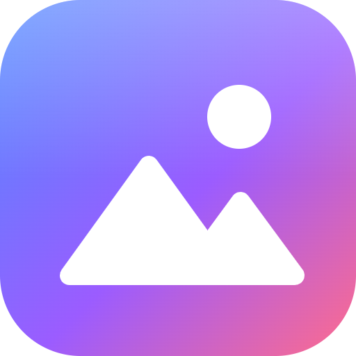

# Pics

A modern photo & video gallery for your desktop. Built with Electron, React and TypeScript.



## Download

Get the latest version from the [Releases page](../../releases/latest):

- **`Pics.Setup.<version>.exe`**: the installer (recommended). Adds Start menu and desktop shortcuts; uninstall it from Windows Settings → Apps.
- **`Pics-<version>-win.zip`**: portable. Unzip it anywhere and run `Pics.exe`; nothing is installed. (Settings and caches still go to `%APPDATA%\Pics`.)

Needs Windows 10 or 11, 64-bit. A graphics card is used when there is one (People, smart search, magic eraser, video previews), otherwise the CPU. HEIC photos and HEVC videos need Windows' **HEIF Image Extensions** and **HEVC Video Extensions** from the Microsoft Store (many PCs have them already).

Pics isn't code-signed, so the first time Windows may show "Windows protected your PC": choose **More info → Run anyway**. The very first start can take up to a minute while Windows checks the new program; after that it opens in a couple of seconds.

Everything runs on your computer: photos, faces and searches are never uploaded. Only the map uses the internet, to show OpenStreetMap images.

## Features

- **Timeline** of every photo and video in your folders, grouped by day (or by month when zoomed out), with a Google Photos–style date scrubber.
- **Fast with big libraries** — virtualised GPU-composited grid, previews generated in parallel on every CPU core (libvips) and the GPU's hardware video decoder, built for the whole library in the background, cached on disk, live folder watching.
- **Real capture dates** from EXIF (photos) and MP4/MOV metadata (videos), falling back to file dates.
- **Viewer** — zoom & pan (wheel, double-click, drag), filmstrip, slideshow, video playback with seeking, blurred ambient backdrop, details panel (camera, lens, exposure, GPS).
- **People** — photos grouped by the faces in them, on-device. Name people (then search by name) and fix any grouping by hand:
  - **Same person?** review of likely duplicate groups (keyboard **Y** / **N** / **S**); "different" answers are remembered.
  - **Possible matches** on each person's page — tick the groups that are the same person and merge them at once.
  - **Multi-select** on the People page → *Merge* / *Hide*. Small groups (1–2 photos) are tucked away behind a "show" button.
  - **Faces** tab per person, least-similar faces first, so wrong matches surface at the top.
  - **Move to…** another person or a new one, **Not this person**, **Use as cover**, **Remove person** — on photos or individual faces.
  - In the viewer's details panel every face gets a chip (unrecognised ones say "Who's this?"); hover it to outline the face in the photo. Faces are found and recognised on the GPU with **InsightFace** (SCRFD-10G detector + ArcFace ResNet-50, "buffalo_l") on ONNX Runtime / DirectML; nothing is uploaded, and *Settings → People* shows where the model runs and can turn it off or delete all face data. The InsightFace pretrained models are licensed for **non-commercial use only**.
- **Search by what's in the photo** — type “beach”, “dog”, “birthday cake” or “receipt” and Pics finds matching photos and videos, with no tags needed. Words that name a person, place or date filter strictly, so “goa beach 2023” means beach photos taken in Goa in 2023. It uses Google's **SigLIP** model (Apache 2.0) on the GPU through ONNX Runtime / DirectML (about 8 ms per photo on an RTX 4070); nothing is uploaded.
- **Places** — photos and videos with a GPS position, grouped by town and filterable by country, plus the place name in the details panel. Place names come from a bundled copy of **GeoNames** (161k towns, CC BY 4.0) and are looked up offline. Phone videos' locations are read too.
- **Memories** — **trips** found automatically from where and when photos were taken (home bases are the places you keep returning to; photos without a location taken during a trip, in the same folders, are included), and **On this day**: photos from today's date in earlier years, as a strip above Photos and on the Memories page.
- **Edit photos** — rotate, flip, straighten, crop (free or fixed proportions, dragged on the photo), auto-enhance, light, contrast, colour and warmth, with a live preview rendered by the same code that saves. Edits are always **saved as a new copy** next to the original (capture date, camera and place kept); HEIC/RAW are decoded at full size by Windows.
- **Videos** — hover a video (or Live Photo) to play a silent preview; long videos remember where you stopped; **Live Photos** (an iPhone still + its short clip) show as one photo with a LIVE button.
- **Albums** — your own collections. Add items from the selection bar, the right-click menu or the viewer, or drag them onto an album in the sidebar. You can rename an album, change its cover or remove items; deleting an album never deletes files.
- **Clean up** (from DupeLens) — finds **exact copies** and **look-alikes** with DupeLens' fingerprint (72×72 grid, 128-bit difference hash in all 8 rotations/mirrorings + 4 centre crops; match threshold 80–99 %), so resized, re-saved, edited, rotated, mirrored and cropped copies are grouped, and loose groups are flagged “check before removing”. **Videos** are compared by their frames (6 sampled frames plus one per second, read in the background), so re-encoded, resized and **trimmed** copies are found; Compare plays a video group side by side on one clock, with trimmed clips starting at the right moment. Keep rules (highest quality, sharpest, largest, oldest, newest) pre-select the copies to remove; protected folders are always kept; the Select menu adds all WhatsApp copies, lower-resolution copies or everything in a folder (never every copy of a group). Each group also has its own **Recycle** button for just its selected copies, on its card and in Compare (one click never removes every copy). **Compare** shows every copy side by side with synced zoom & pan or a swipe view, with keyboard review (1–9, K keep only, D remove, A auto, S swipe, Space next). Also **Blurry & dark**, **Screenshots**, **Large files**, **Duplicate folders** (≥ 90 % overlap) and **Backup check**, an HTML/CSV report, **Move to folder** (default “Duplicates”, not shown in Pics) or **Recycle Bin**, kept copies can take the original's date, and **History** with undo (Ctrl+Z) — moved files can be put back any time.
- **Organize** (from DupeLens) — **fix dates** from file names (WhatsApp, screenshots, camera names) so photos sort by when they were taken; **sort into dated folders** (e.g. 2022\12 - December, move or copy); **rename by date** (only camera/phone names, or all); turn **sideways copies** upright to match their best copy (JPEG orientation tag, lossless); **convert HEIC to JPG** keeping date, camera and place, with the originals set aside in “HEIC originals”. Moved and renamed files keep their previews, faces, favorites, albums and duplicate matches, and everything can be undone from History.
- **Watch for new duplicates** — optionally keeps an eye on the library folders and tells you (Windows notification + in-app) when a new photo or video is a copy of one you already have. It can keep watching from the notification area when the window is closed and start with Windows. **Skip lists**: folders, file types and tiny files can be left out of scans. **“Scan with Pics”** can be added to Explorer's folder right-click menu.
- **Find & sort** — **Find similar** (right-click), **smart albums** (save any search), **Map** of every photo with a place (OpenStreetMap) and **Add location** (suggested from photos taken around the same time, or search 161k towns offline; written losslessly into JPEGs), **ratings & tags** (stars and keywords saved inside JPEGs as XMP so File Explorer and Lightroom see them; filter and search by them), and **search the text in photos** (Windows' own OCR reads screenshots, receipts and signs on this computer).
- **Import & export** — **Import** from a phone, camera, memory card or folder: only new files are copied, into dated folders, optionally converting HEIC to JPG (undo from History). **Export** smaller copies for WhatsApp/email, without location or other details, into a folder or one .zip.
- **Create** — **magic eraser** in the photo editor (brush over people or things; LaMa fills the area on the GPU), **edit videos** (trim, rotate, remove sound, speed, save a frame as a photo — saved as a copy), and **memory movies** of a trip, album or selection (Ken Burns photos, clips, title, music; rendered on the GPU).
- **Private** — hide photos and videos from every view until unlocked with Windows Hello or a Pics PIN, optionally in a hidden folder in File Explorer (not encryption — the app says so).
- **Library tools** — Favorites, Recently added, Folders, search (name, person, place, folder, month, year, camera, content), multi-select (Ctrl/Shift-click), move to Recycle Bin, copy image, drag files out to other apps, right-click menu.
- **Windows 11 look** — Mica window material, light/dark/system theme, accent colors.
- **Uses the discrete GPU** (e.g. NVIDIA RTX) on dual-graphics laptops — see *Settings → Performance*, which also shows the GPU in use.
- **Version badge** in the title bar. Launching a newer build while an older one (1.2+) is open closes the old one automatically.
- HEIC/TIFF/RAW previews when the matching Windows codec extensions are installed.

## Run it

```bash
npm install
npm run models
npm run dev
```

`npm run models` downloads into `models/`:
- the face-recognition models (InsightFace buffalo_l, ~182 MB extracted);
- the smart-search model (SigLIP base, fp16 ONNX, ~392 MB), plus its two calibration numbers read from Google's checkpoint;
- the GeoNames town list, reduced to `places.json.gz` (~2 MB).

`npm run dev` starts Vite with hot reload for the UI and restarts Electron when files in `electron/` change.

## Build an installer

```bash
npm run dist
```

The installer and the portable .zip are written to `release/` (run `npm run models` first: the models are packed into both).

## Keyboard shortcuts

| Key | Action |
| --- | --- |
| Ctrl F | Search |
| Ctrl + / Ctrl − (or Ctrl + wheel) | Bigger / smaller thumbnails |
| Ctrl A, Ctrl/Shift + click | Select all / select / select range |
| Del | Move to Recycle Bin |
| F5 | Rescan library |
| ← → Home End | Navigate in the viewer |
| Space | Slideshow · play/pause video |
| F / I | Favorite / details panel |
| E | Edit photo (Ctrl S save copy, Ctrl Z reset, Esc close) |
| L | Play a Live Photo |
| Ctrl Z / Ctrl H | Undo the last move / History |
| Ctrl R | Review duplicates one by one (in Clean up) |
| + − 0 | Zoom in / out / fit |

## Project layout

```
electron/          main process (CommonJS, no build step)
  main.cjs         window, IPC, context menu
  library.cjs      folder scanning, EXIF/MP4 metadata, index cache, watching
  thumbs.cjs       thumbnail engine: priority queues, sharp/libvips for photos, disk cache,
                   background pre-generation
  workers.cjs      hidden worker windows (GPU video frames, OS thumbnails for HEIC/RAW)
  worker.cjs       code that runs inside those workers
  faces.cjs        People: face index (faces.json), analysis queue, names/merges/corrections,
                   upgrade from older face models (carries the user's choices over)
  face-engine.cjs  InsightFace engine process: SCRFD detection, 5-point alignment, ArcFace
                   512-d faceprints on ONNX Runtime (DirectML GPU, fastest adapter picked)
  faces-cluster.cjs  groups faceprints into people (worker thread; density-based, incremental)
  smart.cjs        smart search: SigLIP embedding per item (smart.bin), text queries, ranking
  smart-engine.cjs SigLIP engine process (image + text encoders, SentencePiece tokenizer, DirectML)
  places.cjs       offline reverse geocoding (GeoNames), photos grouped by town
  duplicates.cjs   exact copies + look-alikes grouped (union-find), keep orders per rule, cached
  albums.cjs       albums (albums.json)
  signature.cjs    DupeLens perceptual fingerprint (8 orientations + crops), sharpness, video frame alignment
  dupes-pairs.cjs  all-pairs look-alike search (worker threads)
  video-frames.cjs look-alike videos: frame fingerprints read in the background (video-frames.bin),
                   same-length and trimmed-clip matching
  cleanup.cjs      move / Recycle Bin / carry dates / restore; history.cjs keeps history.json
  organize.cjs     date fixes, dated folders, renames, HEIC → JPG (from DupeLens)
  edits.cjs        lossless JPEG edits (orientation, date taken) with backups; jpeg-exif.cjs
  background.cjs   tray icon, notifications, start with Windows, folder right-click menu, arguments
  watch-alerts.cjs new-duplicate alerts for files that appear in the library folders
  editor.cjs       photo edits (rotate, straighten, crop, light & colour) saved as copies
  protocol.cjs     gallery:// protocol (files, thumbnails, range requests for video)
  preload.cjs      safe bridge exposed to the UI as window.lumen
src/               React UI (Vite)
  App.tsx          state, filtering, keyboard shortcuts
  components/      Gallery, Viewer, FoldersView, SettingsView, …
  lib/             date formatting, grid layout, video thumbnail fallback
resources/         app icon (icon.svg → icon.png via `npm run icon`)
models/            AI models + place names (npm run models; bundled into the installer)
```

## How previews stay fast

Measured on a 2,000-file library (1,800 × 12 MP JPEGs + 200 × 1080p videos):

| | v1.0 | v1.1 |
| --- | --- | --- |
| Jump anywhere in the timeline (not cached yet) | 1.4–2.1 s | 0.14–0.4 s |
| Land after a fast fling | 30 s | 0.4 s |
| Main process frozen (total) | 88 s | < 1 s |
| Whole library ready | — | ~14 s, then instant on every launch |

- Photos are decoded by **sharp/libvips** (SIMD, JPEG shrink-on-load) on a thread pool sized to the CPU, instead of one at a time on the main thread.
- Video frames come from the **GPU's hardware decoder** in a hidden worker window.
- Formats only Windows can decode (HEIC, RAW) use the shell thumbnailer **in 4 worker processes** (≈9× faster than one), so the app never blocks.
- Windows picks the integrated GPU for Chromium by default; Pics sets `force_high_performance_gpu`, which roughly halves HEVC/H.264 video preview time on an RTX 4070.
- On-screen previews always jump the queue; while you fling or drag the scrubber, nothing loads until you land.

Settings, the library index, the thumbnail cache, faces, albums, the search index and the duplicate cache live in `%APPDATA%\Pics` (or `%APPDATA%\Lumen` when Pics was installed over Lumen, its name before 1.16: that folder keeps being used as it is).
Pics changes your files only when you ask it to: removing (Recycle Bin or a folder, always after asking), Organize, edits saved as copies, and ratings, tags, dates or places written into JPEGs. Changes to files are listed in History and can be undone there.

## License

Pics' own code is under the [MIT license](LICENSE). It bundles software, AI models and data made by others, each under its own license; they are listed in **Settings → About & licenses** and in [`resources/licenses`](resources/licenses). In particular:

- the **InsightFace** face-recognition models (People) are licensed for **non-commercial use only**, so Pics as distributed here must not be sold or used commercially;
- **FFmpeg** (video edits, memory movies) is GPL 3.0; where to get its source is in [`resources/licenses/ffmpeg-source.txt`](resources/licenses/ffmpeg-source.txt);
- place names come from **GeoNames** (CC BY 4.0) and map images from **OpenStreetMap** (© OpenStreetMap contributors).
